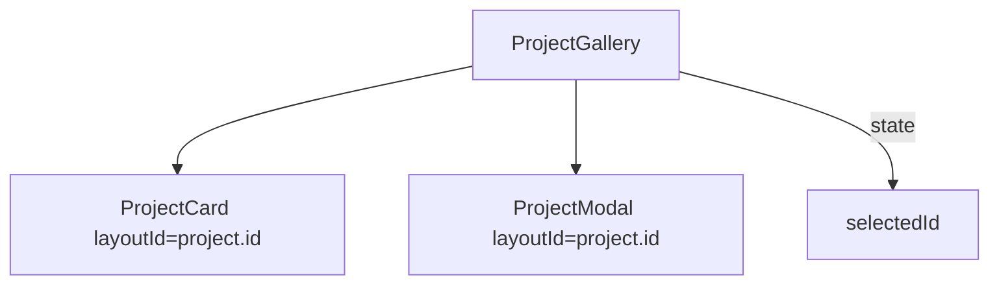

# DES002 — Page Load Improvements (Lazy Background + Gallery Refactor)

**Status:** Implemented (retroactive design)  
**Updated:** 2025-12-18  

## Problem

- Initial page load included a heavy three.js / React Three Fiber dependency (`components/ParticleBackground.tsx`) that could compete with the critical rendering path.
- `components/ProjectGallery.tsx` contained both the grid card and modal implementations in one file, making it harder to evolve (e.g., incremental loading for modal content later).

## Goals

- Reduce initial route JS cost by deferring the 3D background until after first paint.
- Keep `app/layout.tsx` as a server component (do not add `'use client'`).
- Refactor `ProjectGallery` into smaller components with no behavior change.
- Preserve Framer Motion shared layout (`layoutId`) transitions.

## Non-Goals

- Changing the visual design or interaction model of the gallery/modal.
- Implementing a new data fetching strategy or changing Supabase queries.
- Introducing new loading UIs for the background (the body already has a dark background).

## Design

### Lazy-Load Particle Background

**Approach**

- Introduce a client-only wrapper `components/ParticleBackgroundLazy.tsx` that:
  - uses `next/dynamic` to import `components/ParticleBackground.tsx` with `{ ssr: false }`
  - delays mounting until the browser is idle (`requestIdleCallback` with a timeout and a `setTimeout` fallback)
- Replace the static import in `app/layout.tsx` so the heavy 3D code is excluded from the initial server render and split into a separate client chunk.

**Component contract**

- `ParticleBackgroundLazy` renders `null` until idle, then renders `<ParticleBackground />`.
- No props; the wrapper exists only to control when the background mounts.

```mermaid
flowchart TD
  Layout[app/layout.tsx (server)] --> Lazy[ParticleBackgroundLazy (client)]
  Lazy -->|dynamic import ssr:false| PB[ParticleBackground (client, three.js)]
```

**Trade-offs**

- Background may appear slightly after the main content on slower devices.
- If `requestIdleCallback` is unavailable, a short timer fallback is used.

### WebGL Context Loss Handling

**Approach**

- Add `webglcontextlost` / `webglcontextrestored` listeners to the canvas element created by React Three Fiber.
- Call `event.preventDefault()` on context loss to allow the browser to attempt restoration.
- Track a simple `data-webgl-status` state (`ok`/`lost`) and pause R3F rendering via `frameloop="never"` when lost.

### Split ProjectGallery into Components

**Approach**

- Extract the card into `components/ProjectCard.tsx`.
- Extract the modal into `components/ProjectModal.tsx`.
- Keep state management (`selectedId`) and `Escape` key handling in `components/ProjectGallery.tsx`.
- Wrap the gallery in `LayoutGroup` to keep shared-layout transitions smooth after splitting across files.

**Interfaces**

- `ProjectCard`
  - `project: Project`
  - `onClick: (projectId: string) => void`
- `ProjectModal`
  - `project: Project`
  - `onClose: () => void`

**Animation invariants**

- Card and modal both use the same `layoutId={project.id}`.
- `AnimatePresence` remains in `ProjectGallery` so enter/exit works consistently.



## Validation

- Automated: `npm run lint`, `npm run typecheck`, `npm run test`, `npm run build`
- Manual: refresh `/` and confirm content renders before background; open/close modal (click, `Esc`, backdrop); verify responsiveness.
- Tests added:
  - `tests/components/ParticleBackgroundLazy.spec.tsx` (idle + fallback + cleanup)
  - `tests/components/ParticleBackground.spec.tsx` (context loss/restored behavior)

## Follow-Ups (Optional)

- If modal code becomes heavy later: dynamically import modal content and prefetch on card hover/focus to avoid first-open hitch while keeping `layoutId` transitions smooth.
