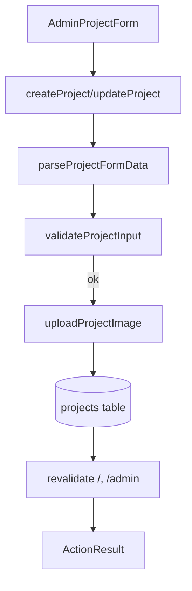

# DES003 - Actions Clustering and Project Helpers

**Status:** Implemented (retroactive design)  
**Updated:** 2025-12-18  

## Problem

- Server actions in `app/actions.ts` mixed authentication and project CRUD concerns.
- Project CRUD repeated form parsing, tag normalization, upload logic, and revalidation.
- Project list queries duplicated across `/` and `/admin`.
- Admin form and particle implementation lived inside larger components, making edits noisier.
- Client components received server action results as `unknown`, triggering lint errors.

## Goals

- Split server actions by domain: auth and projects.
- Centralize project form parsing, validation, tag normalization, and image upload.
- Use a single list query helper for project pages.
- Extract admin form and particle logic into focused components.
- Keep UI behavior, Supabase patterns, and routes unchanged.
- Preserve revalidation behavior for `/` and `/admin`.

## Non-Goals

- Changing database schema, RLS policies, or table structure.
- Introducing new UI features or changing visual styling.
- Adding new auth/role constraints beyond existing middleware.

## Design

### Actions Structure

- `app/actions/auth.ts`: authentication flow only.
- `app/actions/projects.ts`: create/update/delete project actions.
- `utils/actions.ts`: type-safe error extraction for client usage.

### Project Helpers

- `utils/projects/form.ts`
  - `parseProjectFormData` for consistent form extraction and trimming.
  - `normalizeTags` for comma-separated tags.
  - `validateProjectInput` for title + URL validation.
  - `sanitizeFilename` for storage-safe filenames.
- `utils/projects/storage.ts`
  - `uploadProjectImage` for uploads + public URL creation.
- `utils/projects/queries.ts`
  - `listProjects` for the ordered list query used by `/` and `/admin`.

### UI Extraction

- `components/AdminProjectForm.tsx` contains form UI and submit handling.
- `components/particles/Particles.tsx` contains particle generation + animation logic.

### Client Action Result Handling

Server actions resolve to `unknown` on the client. `getActionError` safely extracts
error strings without `any` access.

```ts
getActionError(result: unknown): string | null
```

### Data Flow (Create/Update)



## Validation

- `npm run lint` (passed)
- `npm run typecheck` (passed)
- `npm run test` (passed)

## Follow-Ups (Optional)

- Consider a typed action result wrapper (shared union) once Next typed server
  actions are stable for client usage.
