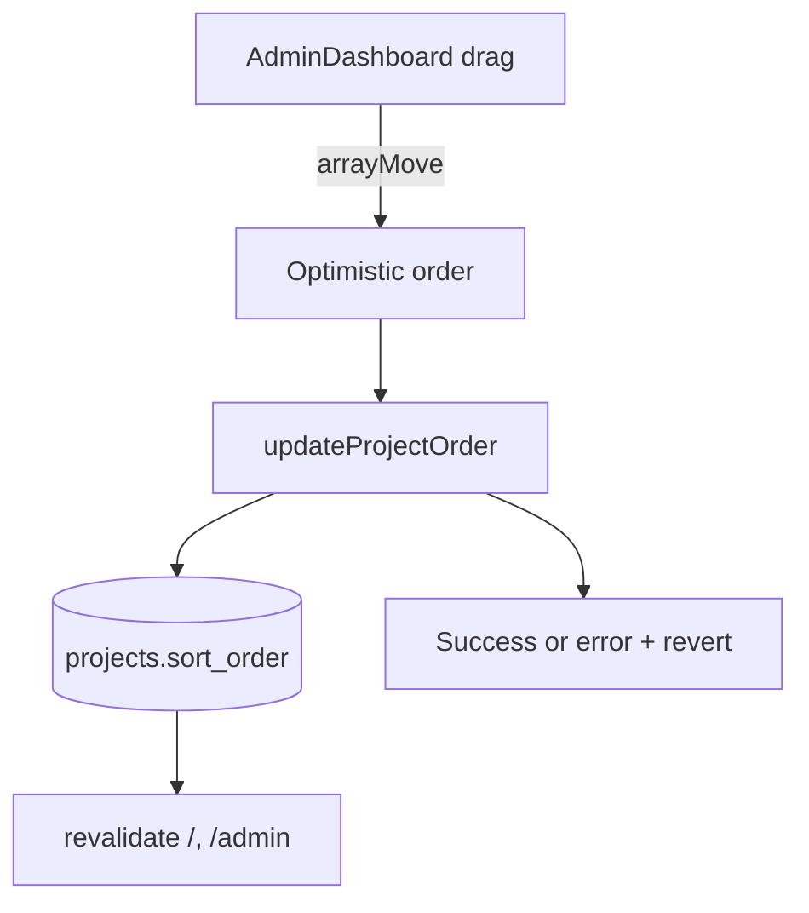

## Status

Implemented (2025-12-18)

## Problem

The admin dashboard lists projects in created order, but there is no way to set a curated order. We need a drag-and-drop experience that feels intentional and persists a global ordering for the public and admin views.

## Goals

- Provide a drag handle to reorder projects in the admin grid without accidental drags.
- Auto-save the new order on drop and keep UI responsive with optimistic updates.
- Persist ordering in Supabase and apply it to both the public gallery and admin list.
- Keep authentication and RLS patterns unchanged for a single admin user.

## Non-Goals

- Per-user ordering.
- Multi-admin permissions or role-based access control changes.
- Bulk edits beyond ordering.

## Requirements (EARS)

1. WHEN an authenticated admin drops a project card into a new position, THE SYSTEM SHALL reorder the list immediately and persist the new order to `projects.sort_order`.  
   Acceptance: reload `/admin` and `/` after a drag; the order matches the new arrangement.
2. WHEN the reorder save fails, THE SYSTEM SHALL restore the prior order and surface an error message.  
   Acceptance: simulate a failed action and confirm UI reverts order and shows error.
3. WHEN projects are listed in admin or public pages, THE SYSTEM SHALL order by `sort_order` ascending with a `created_at` fallback.  
   Acceptance: seeded data with equal `sort_order` sorts by most recent creation.
4. WHEN a new project is created, THE SYSTEM SHALL assign it the next `sort_order` value.  
   Acceptance: new project appears at the end of the list until reordered.

## UX Notes

- Drag handle only: avoids conflicts with checkbox selection and edit button.
- Activation constraint: small movement threshold to prevent accidental drags.
- Visual feedback: lifted card and subtle highlight during drag; saving state indicator in toolbar.
- Keyboard support: `@dnd-kit` keyboard sensor enables accessible reordering.

## Data Model

`projects` table:

- Add `sort_order integer not null default 0`.

## Interfaces

Server Action:

```ts
export async function updateProjectOrder(orderedIds: string[]): Promise<ActionResult>
```

Helper:

```ts
export function buildProjectOrderUpdates(
  ids: string[],
  startAt?: number,
): { id: string; sort_order: number }[]
```

## Data Flow



## Error Handling Matrix

| Scenario | Response | UI Feedback |
| --- | --- | --- |
| Action returns error | Revert to previous order | Global error banner |
| Duplicate IDs in payload | Reject request | Error banner, no reorder |
| Supabase update failure | Revert order | Error banner |

## Validation Plan

- Unit: verify `buildProjectOrderUpdates` and payload validation.
- Unit: update gallery test fixtures for new `sort_order` field.
- Manual: drag a project, confirm new order persists after refresh.

## Dependencies

- `@dnd-kit/core`
- `@dnd-kit/sortable`
- `@dnd-kit/utilities`
